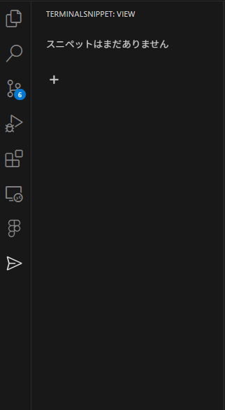
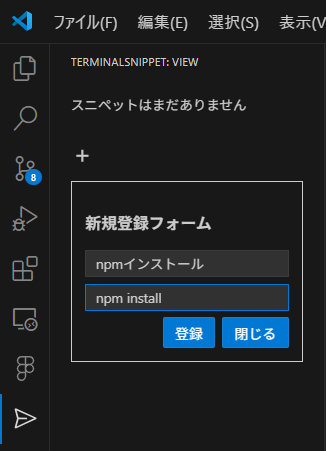
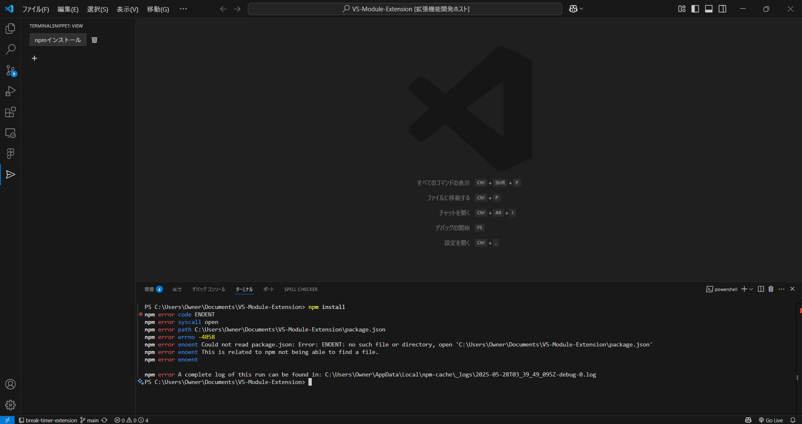

# 🚀 Terminal Snippet Extension

**terminalSnippet** は、頻繁に使うターミナルコマンドを「スニペット」として保存し、素早く実行できる便利な VS Code 拡張機能です。繰り返しの入力作業をなくして、生産性を向上させましょう！

## 🌟 主な機能

- **スニペットの追加**: よく使うコマンドに名前をつけて簡単に保存できます。
- **スニペットの実行**: 保存したスニペットはサイドバーからワンクリックで実行できます。
- **スニペットの削除**: 不要になったスニペットは手軽に削除できます。
- **永続的な保存**: スニペットは VS Code のグローバルストレージに保存されるため、VS Code を閉じてもデータが失われることはありません。

## 💡 小ネタ

### `;` (セミコロン) を利用したコマンドの連結

Terminal Snippet Extension では、通常のターミナルコマンドと同じように、`;` (セミコロン) を使って複数のコマンドを連結して 1 つのスニペットとして保存・実行することができます。これは特に、一連の操作を自動化したい場合に非常に便利です。

**例:**

例えば、プロジェクトの依存関係をインストールし、その後テストを実行するという一連の操作を 1 つのスニペットとして登録したい場合、以下のようにコマンドを連結できます。

```
npm install; npm test
```

このスニペットを実行すると、VS Code のターミナルで`npm install`が実行された後、自動的に`npm test`が実行されます。

#### その他の連結例:

- **ファイルの作成と編集**:
  ```bash
  touch new_file.txt; code new_file.txt
  ```
  `new_file.txt`を作成し、VS Code でそのファイルを開きます。
- **ディレクトリの作成と移動**:
  ```bash
  mkdir my-project; cd my-project
  ```
  `my-project`ディレクトリを作成し、その中に移動します。

このように、`;` (セミコロン) を活用することで、複雑な一連の操作も 1 つのスニペットとして効率的に管理・実行することができます。

## 📸 スクリーンショット







## 📝 使い方

1.  VS Code のサイドバーに表示される "terminalSnippet" アイコンをクリックして、拡張機能のビューを開きます。
2.  「＋」ボタンをクリックして、新しいスニペット登録フォームを表示します。
3.  「スニペット名」と「追加コマンド」を入力し、「登録」ボタンをクリックします。
4.  登録されたスニペットはボタンとして表示され、クリックするとターミナルでコマンドが実行されます。
5.  スニペットの右側にある 🗑️ アイコンをクリックすると、スニペットを削除できます。
